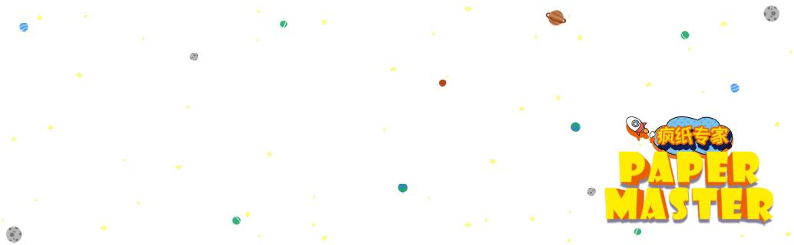
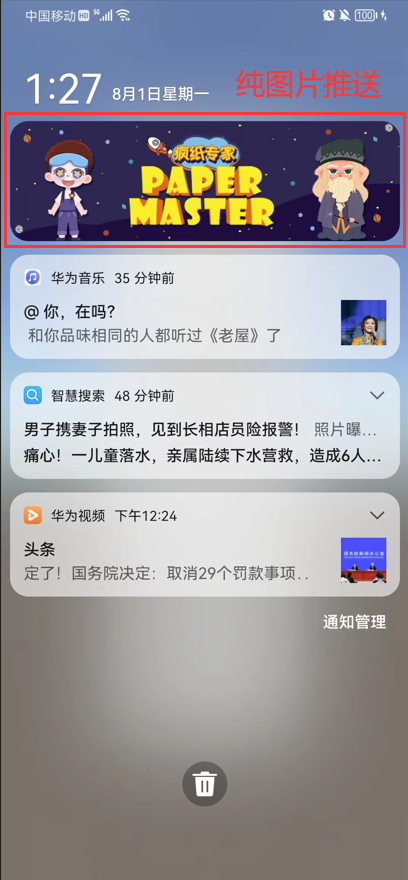
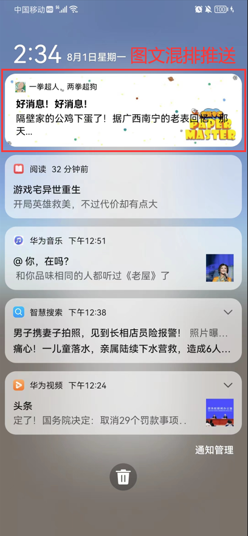
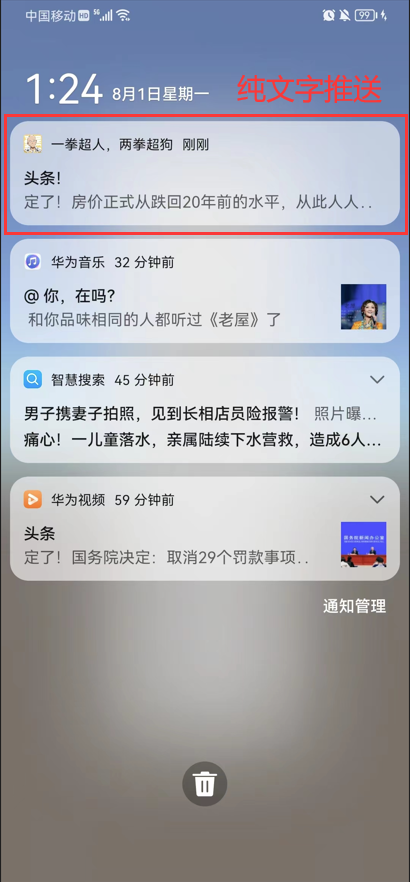

# CustomNotification

**联系作者：419731519（QQ）**

### ============CustomNotification介绍============
#### 笔者认为，平时手机虽然收到很多来自不同应用的推送，但是大多数都是文字推送，千篇一律，没什么亮点
#### 而笔者的这个插件，是为了帮助开发者，能更加方便的推送漂亮的消息，能用图片的方式获取玩家的关注
#### 自定义推送插件，这次笔者准备了多样化的推送方式：1、纯图片推送 2、纯文字推送 3、图文混排推送
#### 希望能帮助到开发者优化玩家的体验感，增加游戏留存
#### 觉得我的插件能帮助到你，麻烦帮我点个Star支持一下❤️

### 参考
- **Emoji表情库:** https://emojixd.com/

### =================使用方法=================
- Gradle中添加依赖/Unity中对应的是：mainTemplate.gradle
```Maven
{
  "dependencies": {
    implementation 'com.nightgame.notification:notification:1.0.3'
    implementation 'androidx.appcompat:appcompat:1.4.1'
    implementation 'com.github.bumptech.glide:glide:4.11.+'
  }
}
```

- 添加下载地址/Unity中对应的是：baseProjectTemplate.gradle
```Maven
{
  "repositories": {
    maven { url 'https://ggdevlee-maven.pkg.coding.net/repository/MyWorld/notification'}
  }
}
```

- 开启AndroidX支持
```Maven
android.useAndroidX=true
android.enableJetifier=true
```

### 需要在Android层，调用Java接口，需要自行创建Unity与Android层的通讯

- 导入包
```java
import com.nightgame.notification.Notification;
```

- Notification初始化，请尽早初始化
```java
Notification.init(activity);
```

- 推送纯文字消息
```java
//title：Title标题
//content：文案
//smallUrl：下载小图标的地址
//enableVibration：是否开启震动
Notification.instance.pushText(title, content, smallUrl, enableVibration);


//title：Title标题
//content：文案
//smallRes：一般指res下的资源
//enableVibration：是否开启震动
Notification.instance.pushText(title, content, smallRes, enableVibration);
```

- 推送纯图片消息
```java
//url：下载背景图的地址
//smallUrl：下载小图标的地址
//enableVibration：是否开启震动
Notification.instance.pushImage(url, smallUrl, enableVibration);

//url：下载背景图的地址
//smallRes：一般指res下的资源
//enableVibration：是否开启震动
Notification.instance.pushImage(url, smallRes, enableVibration);

//bgRes：一般指res下的资源
//smallRes：一般指res下的资源
//enableVibration：是否开启震动
Notification.instance.pushImage(bgRes, smallRes, enableVibration);
```

- 推送图文混排消息
```java
//appName：应用名字
//url：下载背景图的地址
//title：Title标题
//content：文案
//iconUrl：下载Icon的地址
//smallUrl：下载小图标的地址
//enableVibration：是否开启震动
Notification.instance.pushImgAndTxt(appName, url, title, content, iconUrl, smallUrl, enableVibration);

//appName：应用名字
//url：下载背景图的地址
//title：Title标题
//content：文案
//iconRes：一般指res下的资源
//smallRes：一般指res下的资源
//enableVibration：是否开启震动
Notification.instance.pushImgAndTxt(appName, url, title, content, iconRes, smallRes, enableVibration);

//appName：应用名字
//url：下载背景图的地址
//title：Title标题
//content：文案
//iconUrl：下载Icon的地址
//smallRes：一般指res下的资源
//enableVibration：是否开启震动
Notification.instance.pushImgAndTxt(appName, url, title, content, iconUrl, smallRes, enableVibration);

//appName：应用名字
//url：下载背景图的地址
//title：Title标题
//content：文案
//iconRes：一般指res下的资源
//smallUrl：下载小图标的地址
//enableVibration：是否开启震动
Notification.instance.pushImgAndTxt(appName, url, title, content, iconRes, smallUrl, enableVibration);
```


### 参照图


### 效果图


